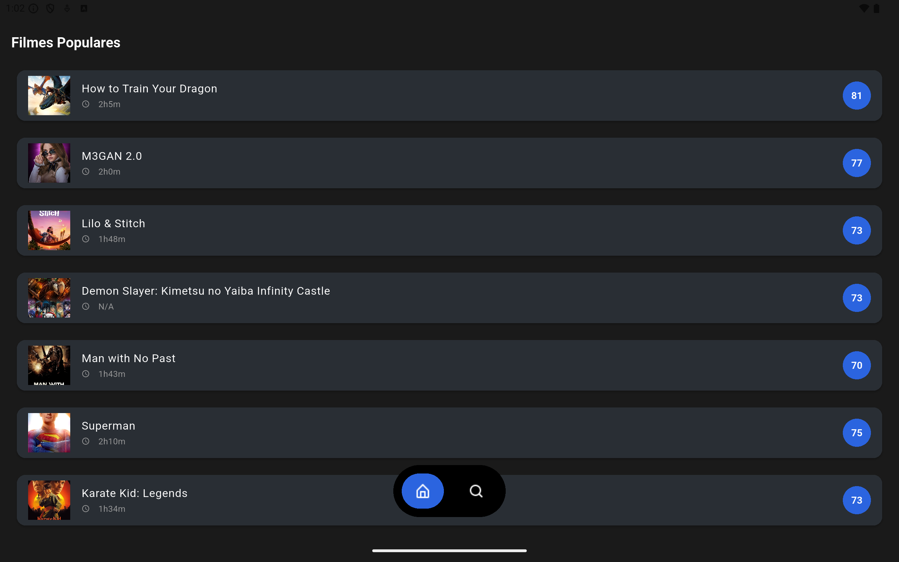
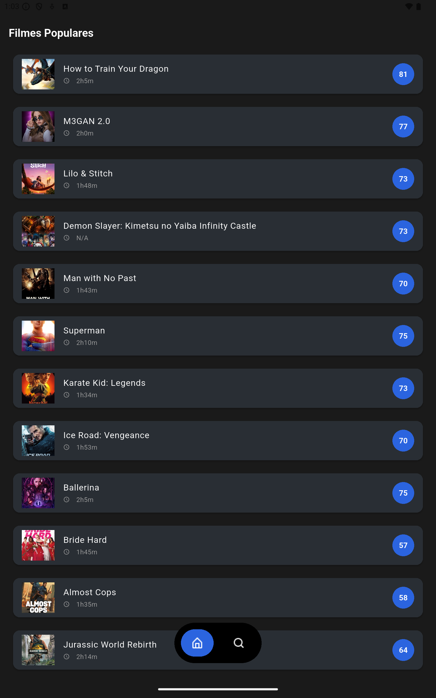
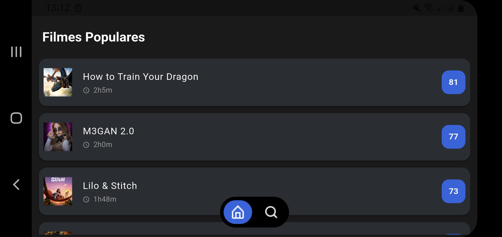
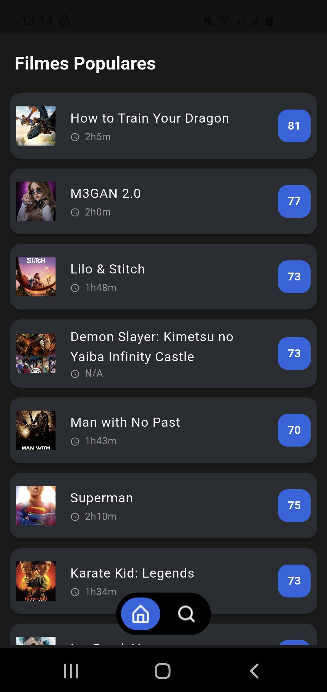
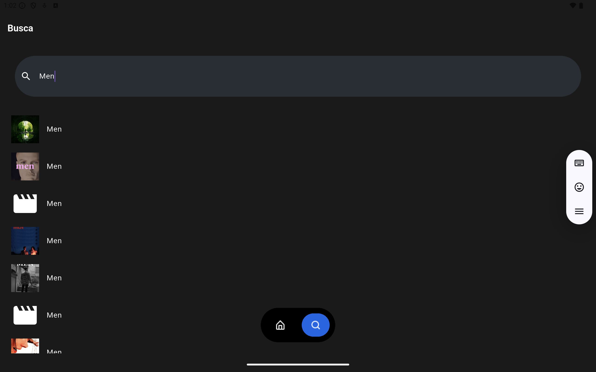
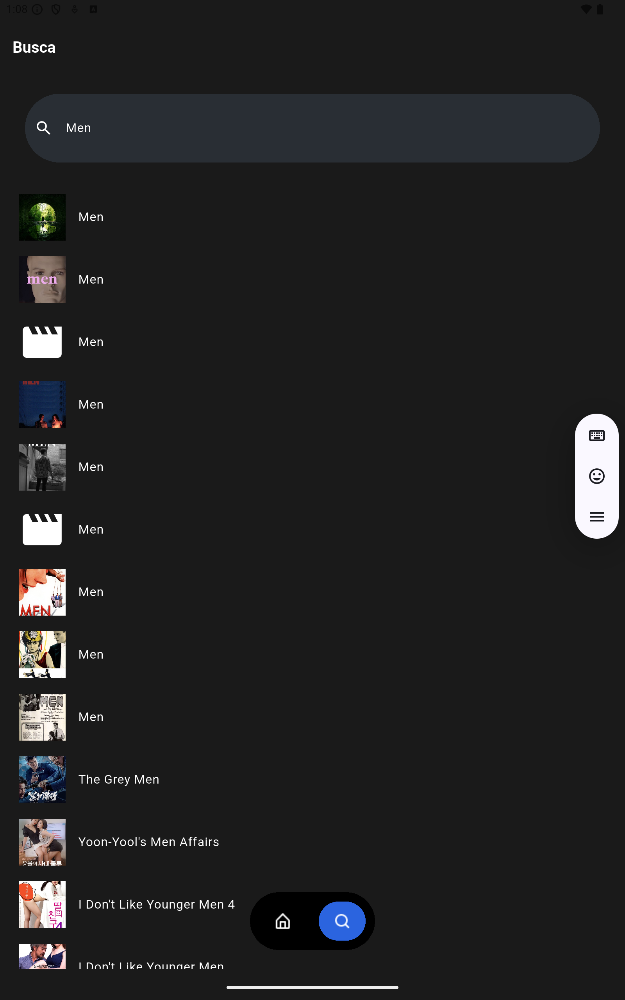
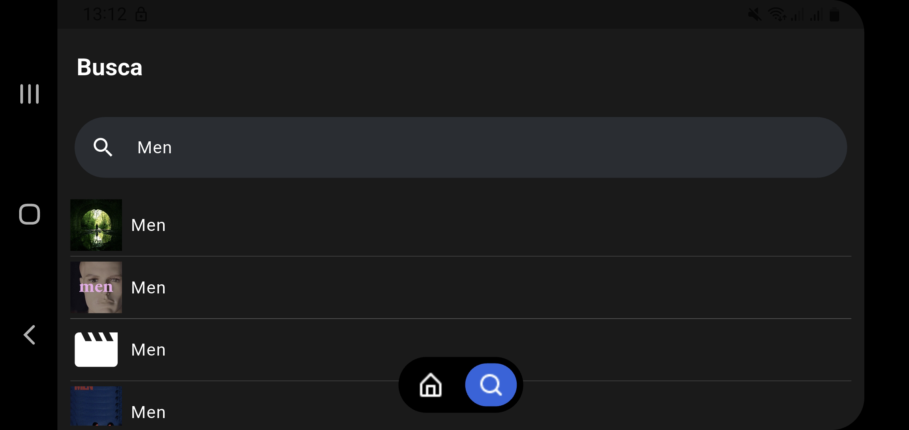
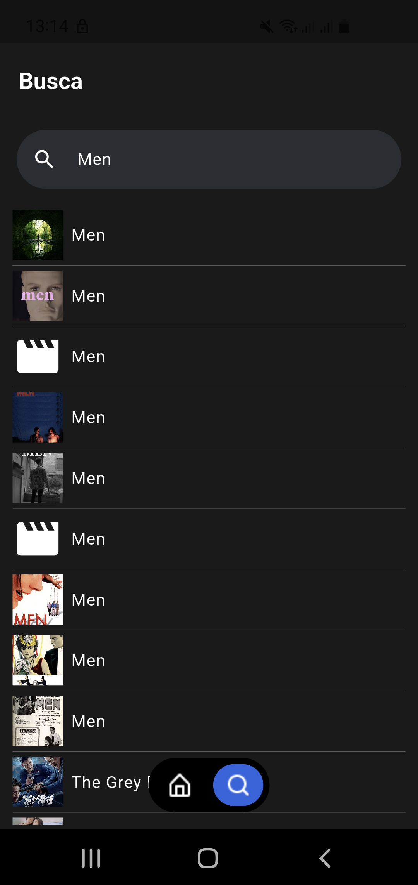

# TMDB App


## 📃 Descrição

O **TMDB App** é um aplicativo mobile desenvolvido em **Flutter** que consome a API do **The Movie Database (TMDB)** para proporcionar uma experiência interativa de exploração e busca de filmes. O app permite visualizar filmes populares com detalhes como título, pôster, duração e nota média, além de oferecer uma funcionalidade de busca por palavras-chave. Com uma interface moderna, transições suaves e design responsivo, o aplicativo garante uma experiência de usuário fluida e consistente em dispositivos com diferentes resoluções e orientações (smartphones, tablets, portrait e landscape).

O projeto segue uma arquitetura modular com separação clara entre apresentação, lógica de negócio e acesso a dados, utilizando injeção de dependências e práticas modernas de desenvolvimento Flutter. A responsividade é priorizada por meio da classe `ResponsivityUtils`, que adapta elementos visuais dinamicamente com base no tamanho da tela, garantindo portabilidade e usabilidade em dispositivos de baixa, média e alta resolução. É ideal para desenvolvedores que desejam estudar uma implementação prática de Flutter com integração de APIs, gerenciamento de estado reativo, responsividade e otimização de performance.

---

## 💻 Tecnologias Utilizadas

- **Flutter**: Framework para interfaces multiplataforma, garantindo consistência visual em Android e iOS.
- **Dart**: Linguagem de programação para lógica e interface.
- **Dio**: Cliente HTTP para chamadas à API do TMDB, com suporte a interceptadores.
- **CachedNetworkImage**: Carregamento eficiente de imagens com cache.
- **Flutter SpinKit**: Animações de carregamento para feedback visual.
- **ChangeNotifier**: Gerenciamento de estado reativo.
- **Dependency Injection (DI)**: Estrutura modular para facilitar manutenção e testes.
- **TMDB API**: API pública para obtenção de dados de filmes.

---

## 🛎️ Funcionalidades

### ✅ Exploração de Filmes Populares
- Exibe uma lista de filmes populares obtida do endpoint `movie/popular` da API do TMDB.
- Cada filme é apresentado em um cartão com:
  - **Pôster**: Carregado via `CachedNetworkImage` com placeholder e ícone de erro, escalado para diferentes resoluções.
  - **Título**: Limitado a duas linhas com elipse.
  - **Duração**: Formatada como "XhYm" (ex.: 2h15m).
  - **Nota Média**: Exibida em um círculo estilizado, calculada como a média de votos multiplicada por 10 e arredondada.
- Suporta estados de interface: carregamento, erro, sem conexão e lista vazia, com opção de retry.

### ✅ Busca de Filmes
- Busca filmes por título ou palavras-chave usando o endpoint `search/movie`.
- Implementa debounce (500ms) para otimizar requisições.
- Exibe resultados em uma lista com pôster, título e divisores, adaptada para diferentes tamanhos de tela.
- O teclado é ocultado ao tocar fora do campo de busca, melhorando a usabilidade.

### ✅ Gerenciamento de Estados
- Utiliza `ChangeNotifier` para atualizações reativas.
- Suporta quatro estados:
  - **Loading**: Animação `SpinKitCircle` com mensagem, redimensionada para a resolução do dispositivo.
  - **Success**: Lista de filmes.
  - **Empty**: Mensagem para ausência de resultados.
  - **No Connection/Error**: Mensagem com botão de retry.

### ✅ Interface Intuitiva
- Navegação entre "Filmes Populares" e "Busca" via barra inferior personalizada, com ícones responsivos.
- Usa `AnimatedSwitcher` com `FadeTransition` para transições suaves.
- Design responsivo com `ResponsivityUtils` para adaptar elementos a diferentes resoluções e orientações.
- Tema escuro com cores contrastantes e ícones personalizados.

### ✅ Otimização de Performance
- Cache de imagens com `CachedNetworkImage` para reduzir requisições em telas de baixa resolução.
- Verificação de conectividade antes de requisições.
- Uso de `AutomaticKeepAliveClientMixin` para preservar estado da lista de filmes populares.

---

## 📱 Responsividade para Diferentes Resoluções

O **TMDB App** foi projetado para funcionar em dispositivos com diferentes resoluções (de smartphones a tablets, em orientações portrait e landscape). A responsividade é garantida por:

- **ResponsivityUtils**: Classe utilitária que calcula dinamicamente:
  - **Padding e Margens**: Ajustados com base em porcentagens do tamanho da tela (`shortestSide`, `screenHeight`) para evitar elementos cortados ou desproporcionais.
  - **Tamanhos de Texto e Ícones**: Escalonados com `responsiveSize` para manter legibilidade e proporção em diferentes tamanhos de tela.
  - **Bordas Arredondadas**: Ajustadas com `responsiveBorderRadius` para consistência visual.
- **Layout Adaptável**:
  - Uso de `Flexible` e `Expanded` para garantir que elementos como pôsteres e textos se ajustem ao espaço disponível.
  - `ListView.builder` com `shrinkWrap` e `physics` personalizáveis para otimizar rolagem em telas maiores.
- **Testes em Diferentes Dispositivos**:
  - Suporte a dispositivos de baixa resolução (ex.: 720p) com tamanhos reduzidos de ícones e textos.
  - Suporte a tablets e dispositivos de alta resolução (ex.: 2K, 4K) com elementos ampliados proporcionalmente.
  - Adaptação a mudanças de orientação (portrait/landscape) sem quebras de layout.
- **Prevenção de Overflow**:
  - Textos longos usam `TextOverflow.ellipsis` para evitar transbordo.
  - `SafeArea` e `resizeToAvoidBottomInset: false` garantem que elementos não sejam obstruídos por barras de sistema ou teclados.
- **Imagens Otimizadas**:
  - `CachedNetworkImage` carrega imagens em resolução apropriada (`w500` da TMDB API) para equilibrar qualidade e performance.
  - Placeholders e ícones de erro redimensionados para manter consistência visual.

Essa abordagem garante que o app seja visualmente consistente e funcional em dispositivos de diferentes densidades de pixels (DPI), tamanhos de tela e proporções.

---

## 📡 Integração com Back-end

### API do TMDB
- **Endpoints**:
  - `movie/popular`: Lista de filmes populares.
  - `search/movie`: Busca de filmes.
  - `movie/{movieId}`: Detalhes do filme, como duração.
- **Autenticação**: Chave de API em `ApiConstants.apiKey`.
- **Base URL**: `https://api.themoviedb.org/3/`.
- **Image Base URL**: `https://image.tmdb.org/t/p/w500`.

### Modelo de Dados
- **`MovieModel`**: Contém `id`, `title`, `voteAverage`, `posterPath`, `runtime`.
- **`MovieResponseDTO`**: Mapeia respostas de listas.
- **`MovieDetailsResponseDTO`**: Mapeia detalhes de filmes.

### Gerenciamento de Conexão e Erros
- **Conectividade**: Verificada via `ConnectivityDriver`, lançando `ConnectionException` se necessário.
- **Erros HTTP** (via `DioClient`):
  - **401**: Chave de API inválida.
  - **404**: Recurso não encontrado.
  - **429**: Limite de requisições.
  - **500+**: Serviço indisponível.
  - Outros: Tratados como `Failure`.

---

## 🎨 Telas do Aplicativo

### Home Page
- Barra de navegação inferior com ícones (`home.png` e `search.png`) para alternar seções, redimensionados para diferentes resoluções.
- Usa `Stack` para posicionar a barra sobre o conteúdo, com botões animados (`AnimatedContainer`).
- Transições suaves com `AnimatedSwitcher` e `FadeTransition`.

### Filmes Populares
- Lista de filmes em `ListView.builder` com cartões estilizados (`Card`), adaptados para diferentes tamanhos de tela.
- Cada cartão exibe:
  - Pôster via `CachedNetworkImage`, escalado com `responsiveSize`.
  - Título (máximo de duas linhas).
  - Duração (ex.: "2h15m" ou "N/A").
  - Nota média em círculo azul, com tamanho responsivo.
- Estados: carregando (`SpinKitCircle`), erro/sem conexão (com retry), vazio.
- **Imagens**:
  | Tablet (Landscape) | Tablet (Portrait) |
  |--------------------|-------------------|
  |  |  |
  | Smartphone (Landscape) | Smartphone (Portrait) |
  |  |  |

### Busca
- Campo de texto com ícone de lupa e borda arredondada, ajustados para a resolução do dispositivo.
- Busca com debounce (500ms).
- Resultados em `ListView` com divisores responsivos.
- Suporta estados de interface semelhantes à tela de filmes populares.
- Teclado ocultado ao tocar fora do campo.
- **Imagens**:
  | Tablet (Landscape) | Tablet (Portrait) |
  |--------------------|-------------------|
  |  |  |
  | Smartphone (Landscape) | Smartphone (Portrait) |
  |  |  |

---

## 🛠️ Ambiente de Desenvolvimento

- **IDE**: Visual Studio Code ou Android Studio.
- **API**: TMDB.
- **Gerenciador de Dependências**: Pub.
- **Dispositivos de Teste**: Emulador Android/iOS ou dispositivo físico.
- **Ferramentas**:
  - Flutter DevTools.
  - Postman (opcional, para testar API).

---

## 📦 Instalação

### 🔧 Pré-requisitos
- [Flutter SDK](https://docs.flutter.dev/get-started/install) (3.22.3+ recomendada).
- [Dart SDK](https://dart.dev/get-dart) (incluso no Flutter).
- Dispositivo ou emulador Android/iOS.
- Chave de API do TMDB (em `ApiConstants.apiKey`).
- Conexão à internet.

### ▶️ Rodando o Projeto
```bash
git clone https://github.com/{seu_usuario}/tmdb_app.git
cd tmdb_app
flutter pub get
flutter run
